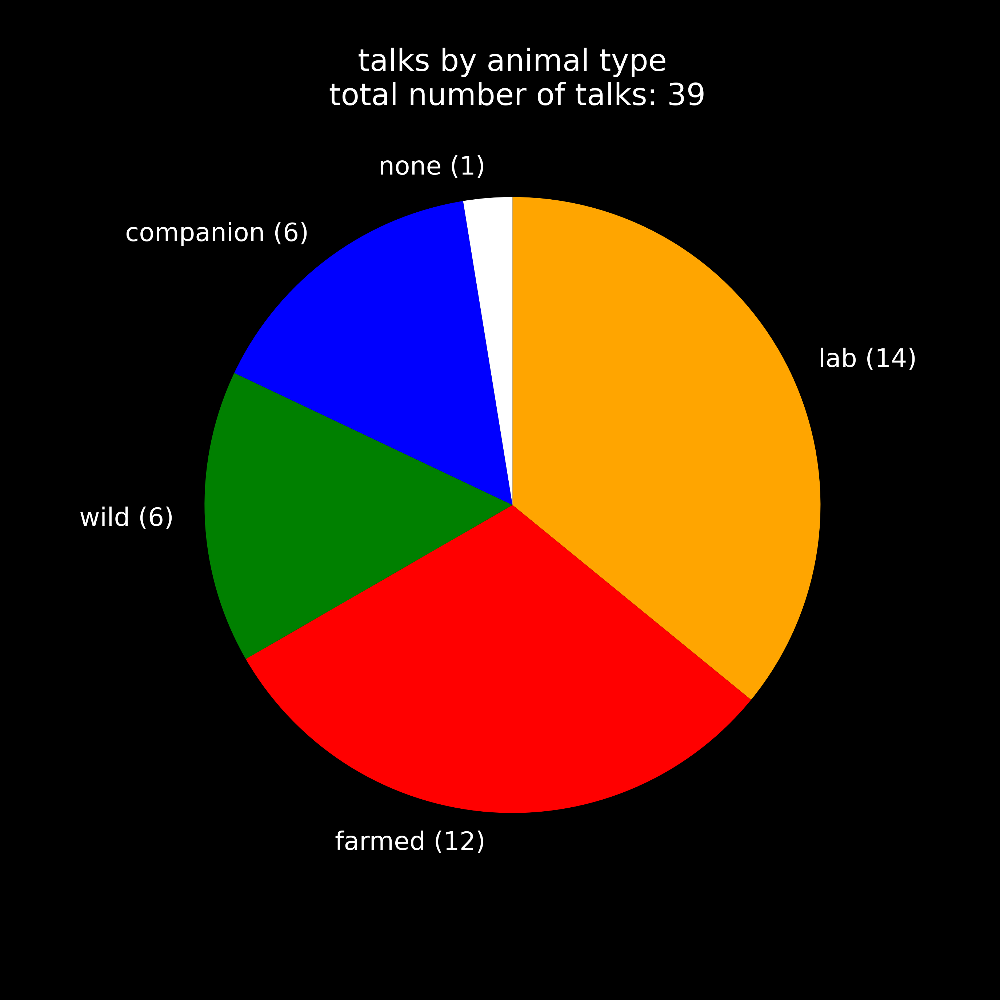

# UFAW 2024 conference stats
last updated: 2024-07-16 by Amanda Matthes

🚧 WORK IN PROGRESS 🚧

## goal
I was interested in analysing what types of animals were represented at the UFAW animal welfare conference 2024 in Porto. This repo includes both the raw data and the code used for this analysis.

## repo structure
- the `data` folder includes the data used here
    - `ufaw_programme_book.pdf` is the official programme book
    - `talks.csv` and `posters.csv` list all the talks and posters, respectively.
- `analysis.py` includes all the code used to produce the figures
- the `output` folder includes all the generated figures

## notes on data collection
- the talks and posters were taken from the official programme, archived here: https://web.archive.org/web/20240704133721/https://www.ufaw.org.uk/downloads/ufaw-2024-prog-book-final.pdf
- I do not distinguish between full length (20 min) talks, key notes (40 min), and short talks (5 min)
- potentially controversial classifications
    - I classified the talk on "Serendipity, sentience, and science: do crustaceans feel pain?" as being about farmed animals - the talk explicitly mentions the food industry but never refers to wild crustaceans
    - I classified "Zoophilia and animal welfare in Europe: Legal challenges and welfare concerns" as being about companion animals - they are the most commonly affected
    - I classified "What do we owe feral animals?" as being about wild animals instead of starting a category for feral animals
    - I gave "Open science for animal welfare and applied ethology" the label "none" as the talk was about open science for the entire field and did not focus on any particular group of animals

## results
Here is how different types of animals were represented in the talks

